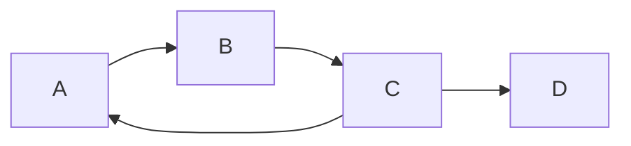
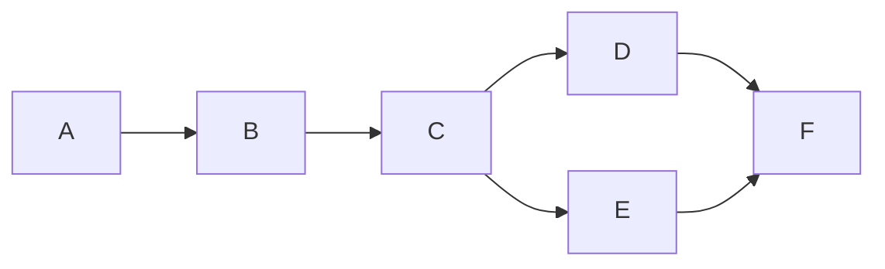
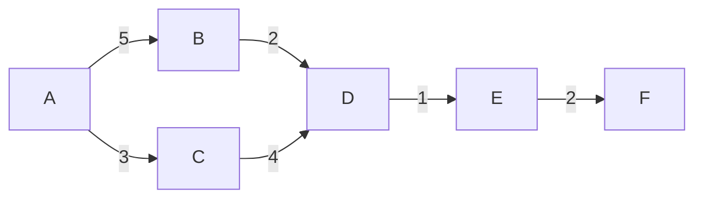
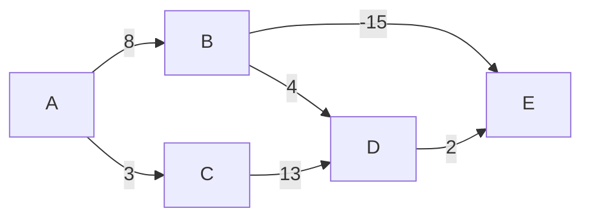
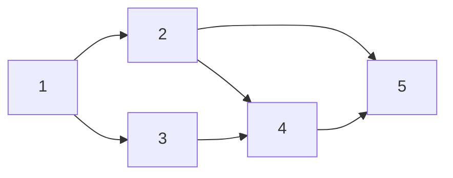
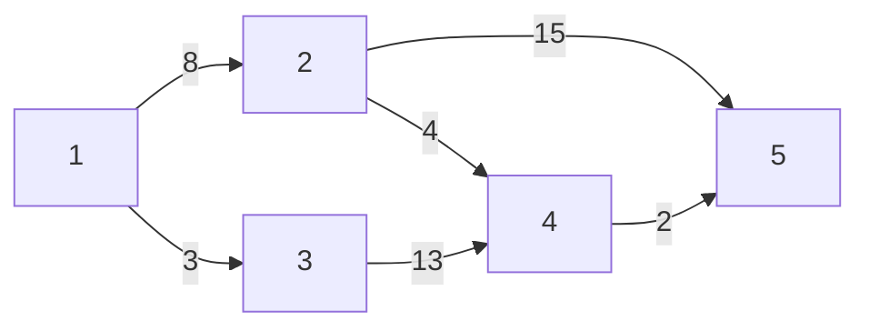

# Graph Algorithm

- union find(유니온 파인드)
- topological sort(위상 정렬)
- dijkstra(다익스트라)
- bellman-ford(벨만-포드)
- floyd-warshall(플로이드-워셜)
- minimum spanning tree(최소 신장 트리)

## Union Find(유니온 파인드)

그래프의 연결성(순환)을 확인하는 알고리즘

## Topological Sort(위상 정렬)

그래프의 순서를 정렬하는 알고리즘

연결성(순환)이 없는 그래프에만 적용 가능
방향이 있는 그래프에만 적용 가능

## Dijkstra(다익스트라)

그래프의 최단 경로를 구하는 알고리즘

음의 가중치가 없는 그래프에만 적용 가능
시작 정점에서 모든 정점까지의 최단 경로를 구할 수 있음

## Bellman-Ford(벨만-포드)

그래프의 최단 경로를 구하는 알고리즘

음의 가중치가 있는 그래프에도 적용 가능
시작 정점에서 모든 정점까지의 최단 경로를 구할 수 있음

## Floyd-Warshall(플로이드-워셜)

그래프의 최단 경로를 구하는 알고리즘

모든 정점에서 모든 정점까지의 최단 경로를 구할 수 있음

## Minimum Spanning Tree(최소 신장 트리)

그래프의 최소 연결 부분 그래프를 구하는 알고리즘

union find 알고리즘을 이용하여 구현 가능

# Graph 표현

- edge list(간선 리스트)
- adjacency matrix(인접 행렬)
- adjacency list(인접 리스트)

## Edge List(간선 리스트)

간선을 리스트로 표현하는 방식

### 가중치 없는 경우

그래프 행을 2배열로 표현

### 가중치 있는 경우

그래프 행을 3배열로 표현

## Adjacency Matrix(인접 행렬)

그래프를 2차원 배열로 표현하는 방식

### 가중치 없는 경우

| | 1 | 2 | 3 | 4 | 5 |
|-|---|---|--|---|---|
|1|   | 1 | 1 |  |  |
|2|   |  |  | 1 | 1 |
|3|  |  |  | 1 |  |
|4|  |  |  |  | 1 |
|5|  |  |  |  |  |

### 가중치 있는 경우

| | 1 | 2 | 3  | 4  | 5  |
|-|---|---|----|----|----|
|1|   | 8 | 3  |    |    |
|2|   |  |    | 4  | 15 |
|3|  |  |    | 13 |    |
|4|  |  |    |    | 2  |
|5|  |  |    |    |    |

