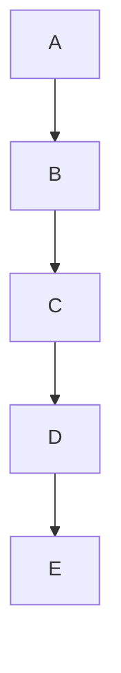
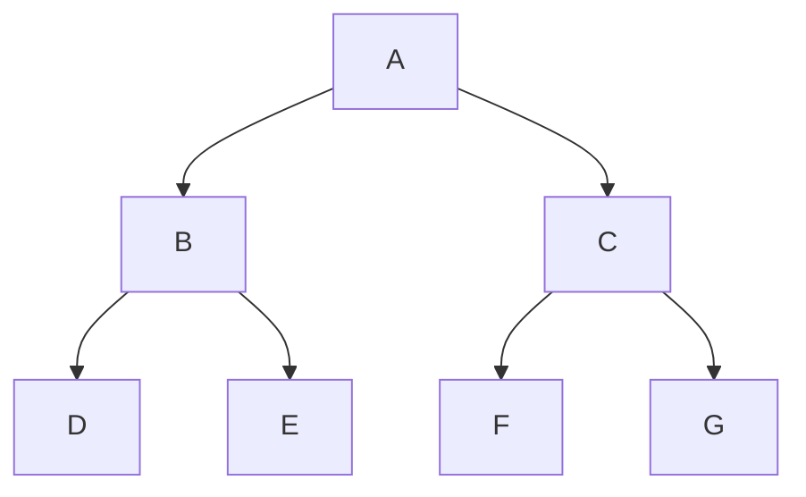
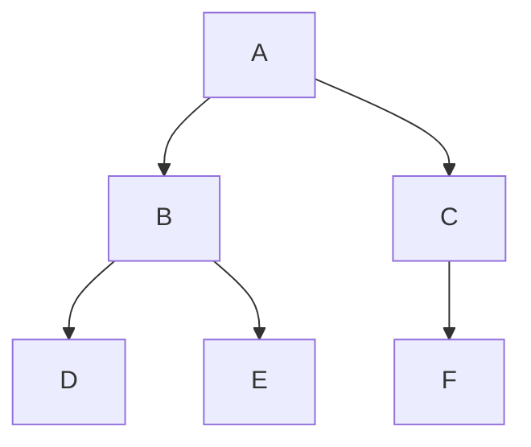
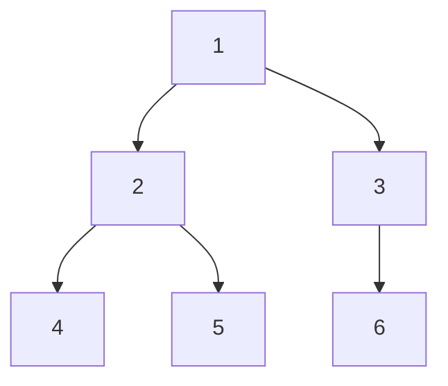
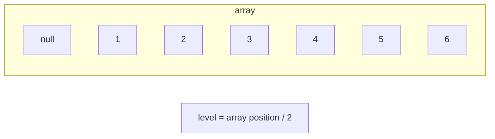

# Binary Tree

각 노드의 자식 노드(차수)의 개수가 2 이하인 트리

# 핵심 이론

## 이진 트리의 종류

### 편향 이진 트리(skewed binary tree)

노드들이 한쪽 방향으로만 연결된 이진 트리

### 포화 이진 트리(full binary tree)

트리의 높이가 모두 일정하며 리프 노드로 꽉찬 이진 트리

### 완전 이진 트리(complete binary tree)

마지막 레벨을 제외하고 완전하게 노드들이 채워져 있고 마지막 레벨은 왼쪽부터 채워져 있는 이진 트리

코딩 테스트에서는 완전 이진 트리를 사용한다고 보면 됨(LCA, index tree 등)

## 이진 트리의 순차 표현

가장 직관적이면서 편리한 트리 자료 구조 형태는 바로 '배열' 형태

배열 형태로 트리를 표현할 때는 노드의 번호를 1부터 시작하는 것이 편리

부모의 인덱스를 구하기 위해서는 자식의 인덱스를 2로 나누고, 자식의 인덱스를 구하기 위해서는 부모의 인덱스에 2를 곱하고 0 또는 1를 더하면 됨

