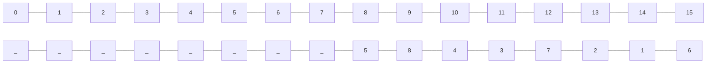
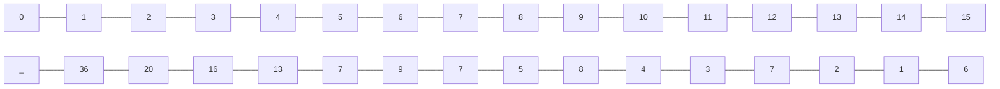
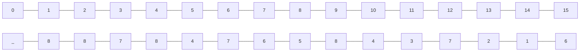
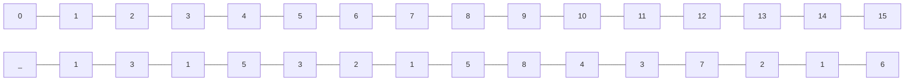
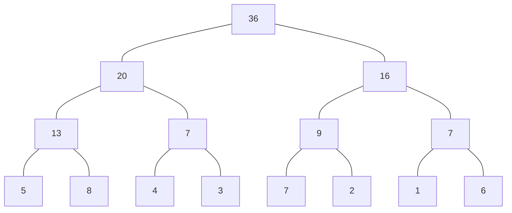
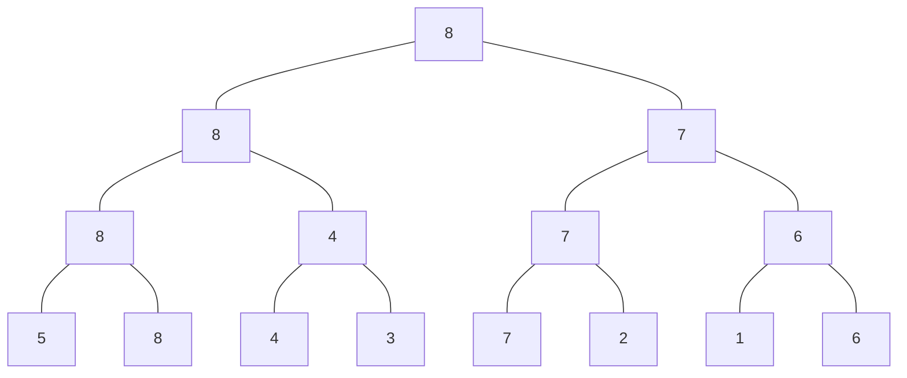
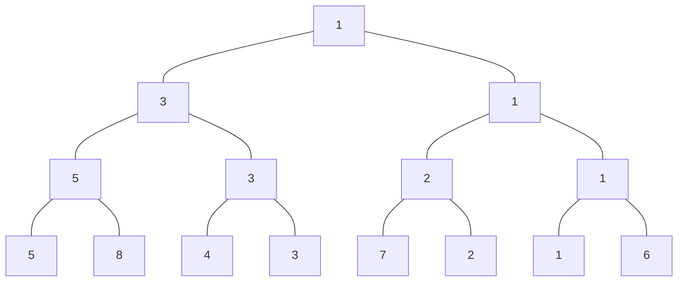

# Segment Tree

주어진 데이터의 구간합과 데이터 업데이트를 빠르게 수행하기 위해 고안해낸 자료구조의 형태가 *Segment Tree* 입니다.
더 큰 범위는 *Index Tree*로 구현할 수 있지만, 이는 *Segment Tree*의 일반화된 형태로 볼 수 있습니다.

*Segment Tree*가 필요한 이유는 구간합의 경우 합배열로 표현할 수도 있지만 이는 구간 업데이트를 수행할 때 O(n)의 시간복잡도를 가지게 됩니다.

| 1 | 2 | 3 | 4 | 5 | 6 | 7 | 8 | 9 | 10 |

| 1 | 3 | 6 | 10| 15| 21| 28| 36| 45| 55 |

위와 같은 배열이 주어졌을 때, 3번째 값이 3에서 5로 변경된다면, 3번째 값부터 10번째 값까지의 합을 다시 계산해야 합니다.

*Segment Tree*는 이를 O(log n)의 시간복잡도로 수행할 수 있습니다.

# 핵심 이론

*Segment Tree*는 트리의 종류는 구간합, 최대값, 최소값 등 다양한 형태로 구현할 수 있습니다.
구현 단계는 트리 초기화하기, 질의값 구하기(구간합, 최대값, 최소값 등), 트리 업데이트하기로 나눌 수 있습니다.
단계별로 설명하겠습니다.

## 트리 초기화하기

리프 노드의 개수가 데이터의 개수(N) 이상이 되도록 트리 배열을 만듭니다.
트리 배열의 크리를 구하는 방법은 **2^k >= N 을 만족하는 k의 최솟값을 구한 후 2^(k+1)를 트리 배열의 크기로 설정**합니다.
예를 들어 다음과 같은 샘플 데이터가 있다면 N=8 이므로 2^3 >= 8 배열의 크리를 2^3 * 2 = 16으로 설정합니다.

> {5, 8, 4, 3, 7, 2, 1, 6}

리프 노드에 원본 데이터를 입력합니다.
이때 리프 노드의 시작 위치를 트리 배열의 인덱스로 구해야 하는데, 구하는 방식은 2^k를 시작 인덱스로 취하면 됩니다.
예를 들어 k의 값이 3이라면 시작 인덱스는 2^3 = 8이 됩니다.

리프 노드를 제외한 나머지 노드의 값을 채웁니다(2^k - 1 부터 1번 쪽으로 채웁니다).
채워야하는 인덱스가 N이라고 가정하면 자신의 자식 노드를 이용해 해당 값을 채울 수 있습니다.
자식 노드의 인덱스는 이진 트리 형식이기 때문에 2N, 2N+1이 돕니다.
케이스별로 적절하게 계산합니다.

> 구간 합: A[N] = A[2N] + A[2N+1]
>
> A[7] = A[14] + A[15] = 1 + 6 = 7

> 최대: A[N] = max(A[2N], A[2N+1])
>
> A[7] = max(A[14], A[15]) = max(1, 6) = 6

> 최소: A[N] = min(A[2N], A[2N+1])
>
> A[7] = min(A[14], A[15]) = min(1, 6) = 1

샘플을 이용해 3개의 케이스와 관련된 세그먼트 트리를 구성해 봤습니다.
구성한 트리 배열을 실제 트리 모양으로 구조화하면 다음과 같이 표현할 수 있습니다.

> 구간 합

> 최대 값

> 최소 값

이렇게 세그먼트 트리를 구성해 놓으면 그 이후 질의와 관련된 결과값이나 데이터 업데이트 요구 사항에 관해 좀 더 빠른 시간 복잡도 안에서 해결할 수 있게 됩니다.

## 질의값 구하기

**주어진 질의 인덱스를 세그먼트 트리의 리프 노으에 해당하는 인덱스로 변경합니다.**
기존 샘플을 기준으로 한 인덱스값과 세그먼트 트리 배열에서의 인덱스 값이 다르기 때문에 인덱스를 변경해야 합니다.
인덱스 변경 방법은 다음과 같습니다.

> 질의 인덱스를 세그먼트 트리 인덱스로 변경하는 방법
>
> 세그먼트 트리 index = 주어진 질의 index + (2^k - 1)
> 
> 앞선 예제의 1 ~ 3 까지의 합을 구하는 경우
> 
> 1 + (2^3 - 1) = 1 + 7 = 8
> 
> 3 + (2^3 - 1) = 3 + 7 = 10
 
질의에서의 시작 인덱스와 종료 인덱스에 관해 부모 노드로 이동하면서 주어진 질의에 해당하는 값을 다음과 같이 구합니다.

> 질의값 구하는 과정
> 
> 1. start_index % 2 == 1 일 때 해당 노드를 선택합니다.
> 2. end_index % 2 == 0 일 때 해당 노드를 선택합니다.
> 3. start_index depth 변경: start_index = (start_index + 1) / 2 연상을 실행합니다.
> 4. end_index depth 변경: end_index = (end_index - 1) / 2 연산을 실행합니다.
> 5. 1 ~ 4 과정을 반복하다가 end_index < start_index 이면 종료합니다.

1~2에서 해당 노드를 선택했다는 것은 해당 노드의 부모가 나타내는 범위가 질의 범위를 넘어가기 때문에 해당 노드를 질의값에 영향을 미치는 독립 노드로 선택하고,
해당 노드의 부모 노드는 대상 범위에서 제외한다는 뜻입니다.
부모 노드를 대상 범위에서 제거하는 방법은 바로 3~4에서 질의 범위에 해당하는 부모 노드로 이동하기 위해 인덱스 연산을 index/2가 아닌 (index+1)/2, (index-1)/2로 수행하는 것입니다.

질의에 해당하는 노드를 선택하는 방법은 구간 합, 최댓값 구하기, 최솟값 구하기 모두 동일하며 선택된 노드들에 관해 마지막에 연산하는 방식만 다릅니다.

> 질의에 해당하는 노드 선택 방법
> 
> 구간 합: 선택된 노드들의 값을 더합니다.
> 최댓값 구하기: 선택된 노드들 중 최댓값을 구합니다.
> 최솟값 구하기: 선택된 노드들 중 최솟값을 구합니다.
 
트리 초기화에서 나온 구간 합 샘플을 이용해 2~6번째 구간 합을 구하는 간단한 예제를 살표보겠습니다.

## 트리 업데이트하기

