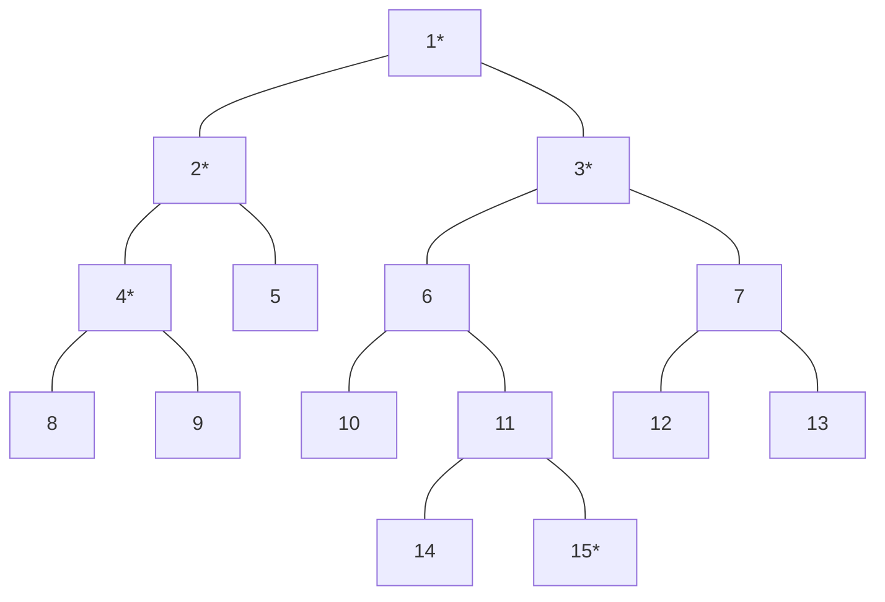

# 최소 공통 조상(LCA)

트리 그래프에서 임의의 두 노드를 선택했을 때 두 노드가 각각 자신을 포함해 거슬러 올라가면서 
부모 노드를 탐색할 때 처음 공통으로 만나게 되는 부모 노드를 '최소 공통 조상(Lowest Common Ancestor)'라고 합니다.

# 최소 공통 조상의 핵심 이론

## 일반적인 최소 공통 조상 구하기

먼저 트리의 높이가 크지 않을 때 최소 공통 조상을 구하는 방법을 예시와 함께 알아보겠습니다.
다음과 같은 트리에서 4번, 15번 노드의 최소 공통 조상을 구해 보겠습니다.
먼저 루트 노드에서 탐색을 시작해 각 노드의 부모 노드와 깊이를 저장합니다.

> 이때 탐색은 DFS or BFS를 이용해 수행합니다.

|index|1|2|3|4|5|6|7|8|9|10|11|12|13| 14  | 15  |
|:--:|:--:|:--:|:--:|:--:|:--:|:--:|:--:|:--:|:--:|:--:|:--:|:--:|:--:|:---:|:---:|
|부모노드|0|1|1|2|2|3|3|4|4|6|6|7|7| 11 | 11 |
|깊이|1|2|2|3|3|3|3|4|4|4|4|4|4| 5  | 5  |

선택된 두 노드의 깊이가 다른 경우, 더 깊은 노드의 노드를 부모 노드로 1개씩 올려 주면서 같은 깊이로 맞습니다.
이 때 두 노드가 같으면 해당 노드가 최소 공통 조상이므로 탐색을 종료합니다.

깉이가 같은 상태에서는 동시에 부모 노드로 올라가면서 두 노드가 같은 노드가 될 때까지 반복합니다.
이때 처음 만나는 노드가 최소 공통 조상이 됩니다.
이러한 원리로 다음 트리에서 4번, 15번 노드의 최소 공통 부모는 1이 됩니다.

위와 같은 방식을 이용하면 최소 공통 조상을 구할 수 있지만, 트리의 높이가 커질 경우, 시간 제약 문제에 직면할 수 있습니다.
이러한 문제를 해결하기 위해 새롭게 제안된 방식이 바로 '최소 공통 조상 빠르게 구하기' 입니다.
