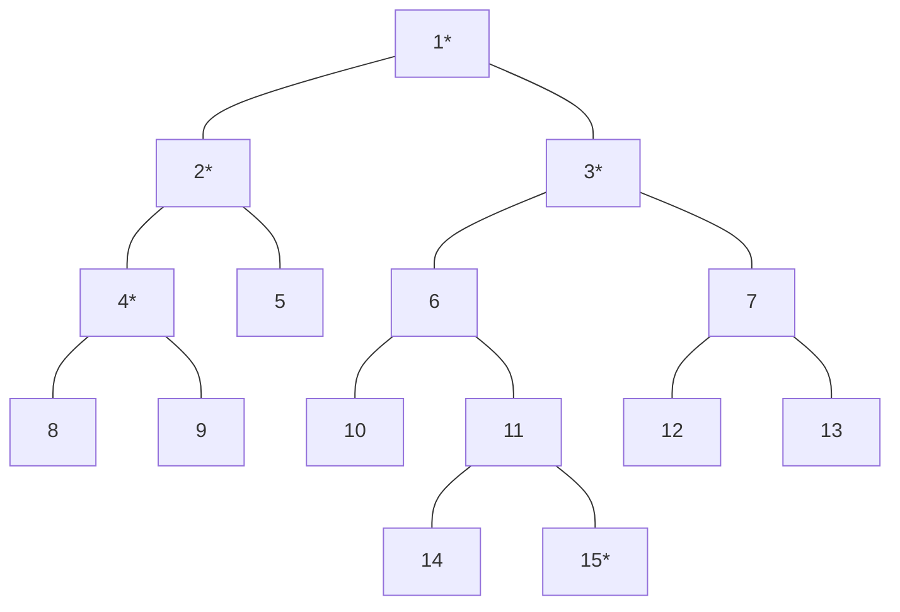
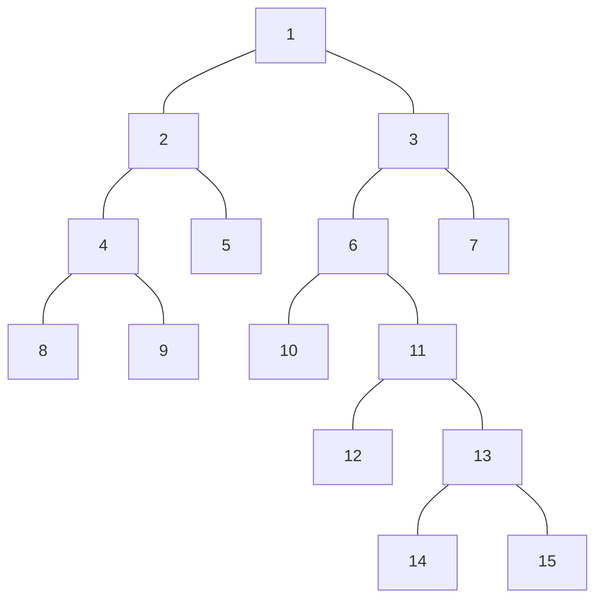

# 최소 공통 조상(LCA)

트리 그래프에서 임의의 두 노드를 선택했을 때 두 노드가 각각 자신을 포함해 거슬러 올라가면서 
부모 노드를 탐색할 때 처음 공통으로 만나게 되는 부모 노드를 '최소 공통 조상(Lowest Common Ancestor)'라고 합니다.

# 최소 공통 조상의 핵심 이론

## 일반적인 최소 공통 조상 구하기

먼저 트리의 높이가 크지 않을 때 최소 공통 조상을 구하는 방법을 예시와 함께 알아보겠습니다.
다음과 같은 트리에서 4번, 15번 노드의 최소 공통 조상을 구해 보겠습니다.
먼저 루트 노드에서 탐색을 시작해 각 노드의 부모 노드와 깊이를 저장합니다.

> 이때 탐색은 DFS or BFS를 이용해 수행합니다.

|index|1|2|3|4|5|6|7|8|9|10|11|12|13| 14  | 15  |
|:--:|:--:|:--:|:--:|:--:|:--:|:--:|:--:|:--:|:--:|:--:|:--:|:--:|:--:|:---:|:---:|
|부모노드|0|1|1|2|2|3|3|4|4|6|6|7|7| 11 | 11 |
|깊이|1|2|2|3|3|3|3|4|4|4|4|4|4| 5  | 5  |

선택된 두 노드의 깊이가 다른 경우, 더 깊은 노드의 노드를 부모 노드로 1개씩 올려 주면서 같은 깊이로 맞습니다.
이 때 두 노드가 같으면 해당 노드가 최소 공통 조상이므로 탐색을 종료합니다.

깉이가 같은 상태에서는 동시에 부모 노드로 올라가면서 두 노드가 같은 노드가 될 때까지 반복합니다.
이때 처음 만나는 노드가 최소 공통 조상이 됩니다.
이러한 원리로 다음 트리에서 4번, 15번 노드의 최소 공통 부모는 1이 됩니다.

위와 같은 방식을 이용하면 최소 공통 조상을 구할 수 있지만, 트리의 높이가 커질 경우, 시간 제약 문제에 직면할 수 있습니다.
이러한 문제를 해결하기 위해 새롭게 제안된 방식이 바로 '최소 공통 조상 빠르게 구하기' 입니다.

## 빠르게 최소 공통 조상 구하기

'최소 공통 조상 빠르게 구하기'의 핵심은 **서로의 깊이를 맞춰 주거나 같아지는 노드를 찾을 때** 기존에 한 단계씩 올려 주느 방식에서 2^k씩 올라가 비교하는 방식입니다.
따라서 기존에 자신의 부모 노드만 저장해 놓던 방식에서 **2^k번째 위치의 부모 노드까지 저장**해 둬야 합니다.
다음 3단계를 이용해 좀 더 자세히 알아보겠습니다.

### 1. 부모 노드 저장 배열 만들기

부모 노드 배열을 만들기 위해서는 이 배열의 정의와 점화식을 학습해야 합니다.

> 부모 노드 배열의 정의
> 
>P[K][N] = N번 노드의 2^K번째 부모 노드 번호

> 부모 노드 배열의 점화식
>
> P[K][N] = P[K - 1][p[K - 1][N]]

점화식에서 N의 2^K번째 부모 노드는 N의 2^(K-1)번째 부모 노드의 2^(k-1)번째 부모 노드라는 의미 입니다.
즉, K = 4라고 가정하면 N의 16번째 부모 노드는 N의 8번째 부모 노드의 8번째 부모 노드가 됩니다.
이 점화식을 사용해 배열을 채워 보겠습니다.

배열에서 K는 '트리의 깊이 > 2^K'를 만족하는 최대값 입니다.
다음 트리에서 최대 깊이는 5이기 때문에 K = 2가 됩니다.
즉, 이 트리의 모든 노드는 2^3 번째 부모 노드를 지닌 경우가 없습니다.

부모 노드 배열의 점화식을 이용해 배열의 값을 채워 보겠습니다.

| index | 1 | 2 | 3 | 4 | 5 | 6 | 7 | 8 | 9 | 10 | 11 | 12 | 13 | 14 | 15 |
|:-----:|:-:|:-:|:-:|:-:|:-:|:-:|:-:|:-:|:-:|:--:|:--:|:--:|:--:|:--:|:--:|
|   0   |   | 1 | 1 | 2 | 2 | 3 | 3 | 4 | 4 | 6  | 6  | 11 | 11 | 13 | 13 |
|   1   |  |   |   | 1 | 1 | 1 | 1 | 2 | 2 | 3 | 3 | 6  | 6  | 11 | 11 |
|   2   |  |  |  |   |   |   |   |   |   |    |    | 1  | 1  | 3  | 3  |

> 0번째 행: K = 0번째 배열을 탐색해 초기화
> 1번째, 2번째 행: 점화식으로 채움

초기화된 배열을 바탕으로 K를 1개씩 증가시키면서 나머지 배열을 채웁니다.
이해를 돕기 위해 14의 2^2번째, 즉 4번째 부모 노드(P[2][14])를 예로 구해 보겠습니다.

P[2][14] = P[1][P[1][14]] 

=> P[1][14] = P[0][P[0][14]]] = P[0][13] = *11*

=> P[2][14] = P[1][*11*]

=> P[1][11] = P[0][P[0][11]] = P[0][6] = 3

$\\therefore$ P[2][14] = *3*

2. 선택된 두 노드의 깊이 맞추기

P 배열을 이용해 기존에 한 단계씩 맞췄던 깊이를 2^K 단위로 넘어가면서 맞춥니다.
예를 들어 노드 2와 노드 15의 깊이를 맞춰 보겠습니다.
노드 2의 깊이는 2, 노드 15의 깊이는 6으로 두 노드의 깊이 차이는 4입니다.
깊이를 맞추기 위해 더 깊이 있는 노드 15의 4번째 부모 노드를 P 배열을 이용해 찾아습니다.
4 = 2^2 이므로 K = 2 이고, P[2][15] = 3이므로 노드 3으로 이동하면 노드 2와 높이를 맞추게 됩니다.

만약 높이 차이가 20이라고 가정하면 2^K <= 20을 만족하면서 K가 최대가 되는 만큼 이동하면서 높이 차이가 0이 될때까지 반복합니다.
즉, 높이 차이가 20일 경우에는 2^4(16) -> 2^2(4)와 같이 두번 이동하게 됩니다.

3. 최소 공통 조상 찾기

공통 조상을 찾는 작업 역시 한 단계씩이 아닌 2^K 단위로 이동하면서 비교합니다.
K값으 1씩 감소하면서 P 배열을 이용해 두 노드의 부모 노드가 달라지는 값을 찾습니다.

P[2][14] = 3, P[2][15] = 3

P[1][14] = 10, P[1][15] = 11

최초로 달라지는 K에 대한 두 노드의 부모 노드를 찾아 이동합니다.
즉 노드 10, 노드 11로 이동합니다.
이를 K가 0이 될 때까지 반복합니다.
반복문이 종료된 후 이동한 2개의 노드가 같은 노드라면 해당 노드가, 다른 노드라면 바로 위의 부모노드가 최초 공통 조상이 됩니다.
여기에서는 노드 10, 11이 다른 노드이기 때문에 바로 위 노드를 뜻하는 P[0][10] 또는 P[0][11], 즉 노드 6이 최소 공통 조상이 됩니다.

P[0][10] = 6, P[0][11] = 6

$\\therefore$ LCA = 6

